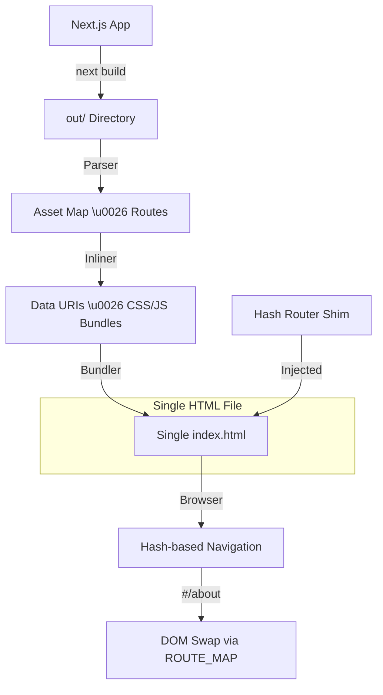

# Next.js Single HTML CLI 🚀

A powerful CLI tool that transforms a Next.js static export into a **completely self-contained, single HTML file** with hash-based routing. Regex based, zero deps.
## 📖 How it Works

The tool crawls your `out/` directory, extracts all routes, and bundles them into a single file. It inlines all assets (JS, CSS, Fonts, Images) as Data URIs (base64) and injects a robust hash-based router.

### 🏗 Architecture



## 🛠 Features

- **Self-Contained**: Zero external dependencies. Fonts, images, and scripts are all inlined.
- **Hash Routing**: Automatically converts path navigation to `#/hash` navigation.
- **Next.js Compatibility**: Supports latest Next.js features like Geist fonts and Turbopack.
- **Robust Escaping**: Uses Base64 encoding for the internal route map to prevent minified JS syntax errors.
- **Shims**: Automatically shims `document.currentScript` and other browser APIs that Next.js expects.

## 🚀 Usage

### 1. Generate Static Export
Ensure your `next.config.js` has `output: 'export'`:

```javascript
/** @type {import('next').NextConfig} */
const nextConfig = {
  output: 'export',
};
module.exports = nextConfig;
```

Then build:
```bash
npm run build
# or
bun run build
```

### 2. Run the Inliner
```bash
# you need bun installed (can be run by npm tho)
bunx next-single-file --input out --output dist/index.html
# or npm, needs bun installed
npx next-single-file --input out --output dist/index.html

```

## 🎯 Use Cases

- **Portable Demos**: Send a fully functional web app as a single email attachment.
- **Offline Documentation**: Create rich, interactive docs that work without an internet connection.
- **Embedded UIs**: Embed a Next.js interface into desktop applications or hardware dashboards.
- **Simple Hosting**: Host a multi-page app on GitHub Gists or any basic file server.

## 🧪 Development

To run the tests:
```bash
bun test
```
