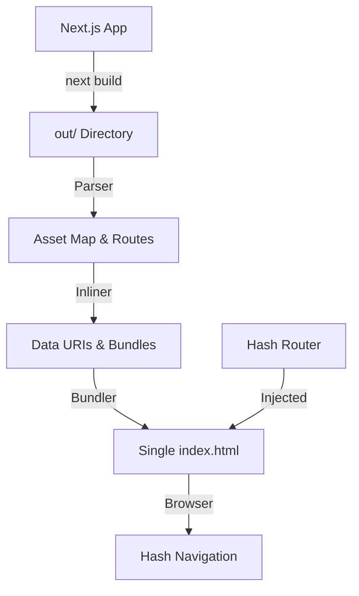

# next-single-file

[](https://www.npmjs.com/package/next-single-file)
[](https://www.npmjs.com/package/next-single-file)
[](https://nextjs.org)
[](https://bun.sh)

A CLI tool that transforms a Next.js static export into a **single, self-contained HTML file** with hash-based routing. Regex-based, zero runtime dependencies.

## How it Works

The tool parses your `out/` directory, extracts all routes, and bundles everything into one file. All assets (JS, CSS, fonts, images) are inlined as base64 data URIs, and a hash-based router is injected for client-side navigation.



## Features

- **Self-Contained** — Zero external dependencies. Fonts, images, and scripts are all inlined.
- **Hash Routing** — Automatically converts path navigation to `#/hash` navigation.
- **Next.js Compatible** — Supports Geist fonts, Turbopack, and modern Next.js features.
- **Robust Encoding** — Uses Base64 for the internal route map to prevent minification issues.
- **Browser Shims** — Polyfills `document.currentScript` and other APIs Next.js expects.

## Installation

```bash
bunx next-single-file --input out --output dist/index.html
```

Or with npm (requires Bun to be installed):

```bash
npx next-single-file --input out --output dist/index.html
```

## Usage

### 1. Configure Next.js for Static Export

Ensure your `next.config.js` has `output: 'export'`:

```javascript
/** @type {import('next').NextConfig} */
const nextConfig = {
  output: 'export',
};

module.exports = nextConfig;
```

> [!WARNING]  
> **Purely Client-Side Runtime**  
> This tool generates a standalone bundle with no backend. 
> - **Server Logic:** Features like Server Actions, `cookies()`, and Middleware are not supported.
> - **Dynamic Routes:** You must use `generateStaticParams` for any dynamic paths (e.g., `[id].tsx`) to ensure they are pre-rendered into the `out/` directory before bundling.
> - **RSC:** React Server Components are supported only insofar as they can be statically rendered to HTML at build time.

### 2. Build Your Next.js App

```bash
# Any pkg manager is fine
bun run build
```

### 3. Generate Single HTML File

```bash
# npx works too, you need bun installed on your system though
bunx next-single-file --input out --output dist/index.html
```

## Use Cases

| Use Case | Description |
|----------|-------------|
| **Portable Demos** | Send a fully functional web app as a single email attachment |
| **Offline Documentation** | Create interactive docs that work without internet |
| **Embedded UIs** | Embed Next.js interfaces into desktop apps or dashboards |
| **Simple Hosting** | Host multi-page apps on GitHub Gists or basic file servers |

## Benchmark

Performance on the included test Next.js app (averaged over 3 runs):

| Metric | Value |
|--------|-------|
| **Duration** | ~392 ms |
| **Output Size** | ~13.9 MB |
| **Memory Usage** | ~77 MB |

Run your own benchmark:

```bash
bun run benchmark
```

> Results may vary based on your app size and system. The test app includes 4 routes with images, fonts, and interactivity.

## Development

```bash
bun install
bun test
bun run build
```

## License

MIT
